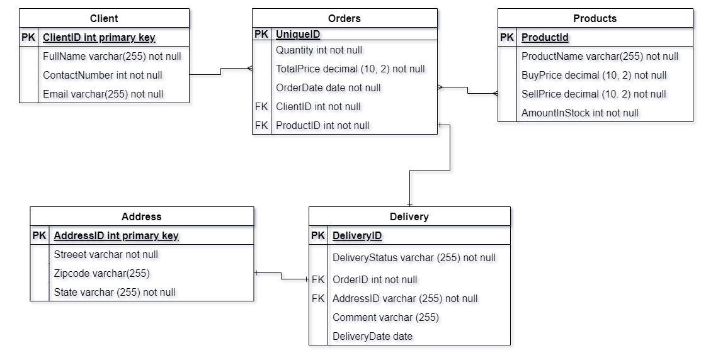
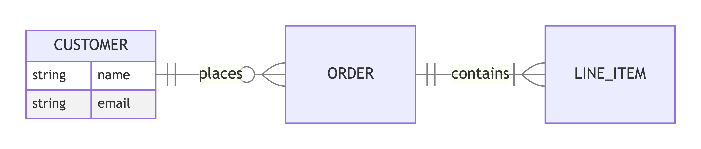

# Eines per crear diagrames de bases de dades

UT Emmagatzematge i Modelatge de dades  


Sistemes de Big Data

---

# :dart: Objectius de la presentació
Comparar tres eines útils per crear diagrames / esquemes en el context del disseny de bases de dades:  

- :link: [draw.io](https://app.diagrams.net/)
- :link: [Mermaid](https://mermaid.js.org/)
- :link: [MS Visio](https://www.microsoft.com/es-es/microsoft-365/visio/flowchart-software)

---

## draw.io, a [https://app.diagrams.net/](https://app.diagrams.net/)

### :sparkles: Punts forts:
- Gratuït i basat en web (també disponible offline).
- Interfície gràfica intuïtiva amb arrossegar i deixar anar.
- Plantilles específiques per ERD.
- Permet definir entitats, atributs i relacions amb connectors intel·ligents.

### :bulb: Funcionalitats destacades:
- Crear entitats amb formes predefinides.
- Afegir atributs com a llistes dins dels blocs.
- Connectar entitats amb línies que representen relacions (1:1, 1:N, N:M).

---
## draw.io, a [https://app.diagrams.net/](https://app.diagrams.net/)

- Tutorial: [Create ERD with draw.io](https://www.youtube.com/watch?v=JYZPdU5F2iM)

<style scoped> 
    img {
    width: 800px;
    border-radius: 5px;
    margin: auto;
    }
</style>



---

## Mermaid, a [https://mermaid.js.org/](https://mermaid.js.org/)

### :sparkles: Punts forts:
- Basat en codi: ideal per a desenvolupadors.
- Integració fàcil amb Markdown, GitHub, VS Code, etc.
- Lleuger i fàcil de versionar.

### :fishing_pole_and_fish: Recursos
- Documentació: [ERD Mermaid](https://mermaid.js.org/syntax/entityRelationshipDiagram.html)

---

## Mermaid, a [https://mermaid.js.org/](https://mermaid.js.org/)

```markdown
 %%{init: {'er': { 'layoutDirection': 'LR' }}}%%
erDiagram
    CUSTOMER ||--o{ ORDER : places
    ORDER ||--|{ LINE_ITEM : contains
    CUSTOMER {
        string name
        string email
    } 
```

<style scoped> 
    img {
    width: 1000px;
    border-radius: 5px;
    margin: auto;
    }
</style>



---

## Visio, a [https://www.microsoft.com/es-es/microsoft-365/visio/flowchart-software](https://www.microsoft.com/es-es/microsoft-365/visio/flowchart-software)

### :sparkles: Punts forts:
- Eina professional amb integració a l’ecosistema Microsoft.
- Plantilles avançades per a models de bases de dades.
- Pot importar esquemes de bases de dades reals (si es disposa de l’edició correcta).

### :bulb: Funcionalitats destacades:
- Creació visual d’entitats i relacions.
- Generació automàtica de diagrames a partir de bases de dades existents.
- Personalització avançada de formats i estils.

---

## Visio, a [https://www.microsoft.com/es-es/microsoft-365/visio/flowchart-software](https://www.microsoft.com/es-es/microsoft-365/visio/flowchart-software)

- Article: [Create a Database Model in Visio](https://support.microsoft.com/en-us/office/create-a-database-model-also-known-as-entity-relationship-diagram-in-visio-7042e719-384a-4b41-b29c-d1b35719fc93)

<style scoped> 
    img {
    width: 650px;
    border-radius: 5px;
    margin: auto;
    }
</style>


---

<style scoped> 
    table {
    margin: auto;
    }
</style>

## Comparativa

| Eina          | Tipus          | Ideal per a...        | Cost        |
| :------------ | :------------- | :---------------------| :---------- |
| draw.io       | Gràfic         | Usuaris visuals       | Gratuït     |
| Mermaid       | Basat en codi  | Desenvolupadors       | Gratuït     |
| MS Visio      | Gràfic avançat | Empreses / entorns MS | Subscripció |

## Conclusió  

- :link: [draw.io](https://app.diagrams.net/) millor per a usuaris que prefereixen una interfície visual i gratuïta.
- :link: [Mermaid](https://mermaid.js.org/) ideal per a entorns tècnics i documentació versionada.
- :link: [MS Visio](https://www.microsoft.com/es-es/microsoft-365/visio/flowchart-software) potent per a entorns corporatius amb integració de dades.
