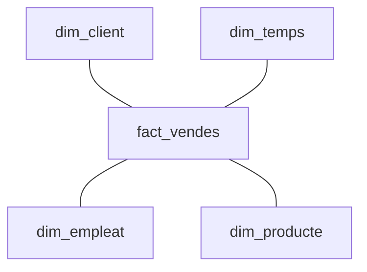
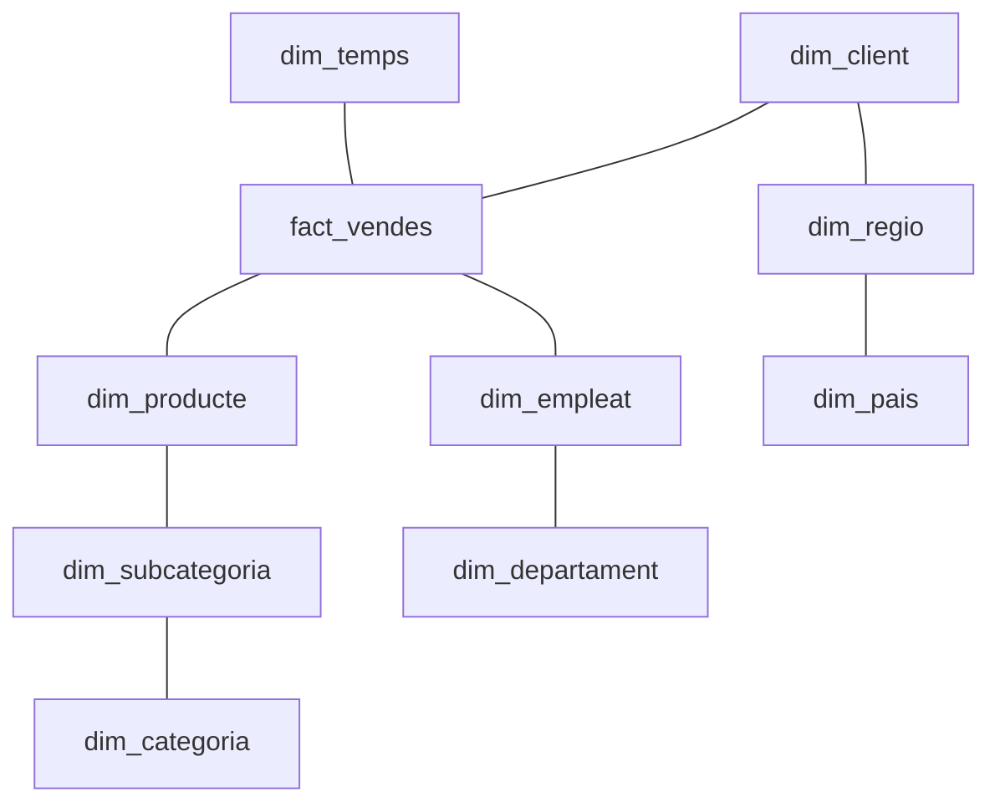

STAR SCHEMA  

```mermaid
graph TD
    A["`dim_client`"]
    A --- B["`fact_vendes`"]
    B --- C["`dim_empleat`"]
    D["`dim_temps`"]
    D --- B
    E["`dim_producte`"]
    B --- E
```  
 
 
 

SNOWFLAKE SCHEMA  

```mermaid
graph TD
    A["`dim_client`"]
    A --- B["`fact_vendes`"]
    B --- C["`dim_empleat`"]
    D["`dim_temps`"]
    D --- B
    E["`dim_producte`"]
    B --- E
    E --- F["`dim_subcategoria`"]
    F --- G["`dim_categoria`"]
    C --- H["`dim_departament`"]
    A --- I["`dim_regio`"]
    I --- J["`dim_pais`"]
```