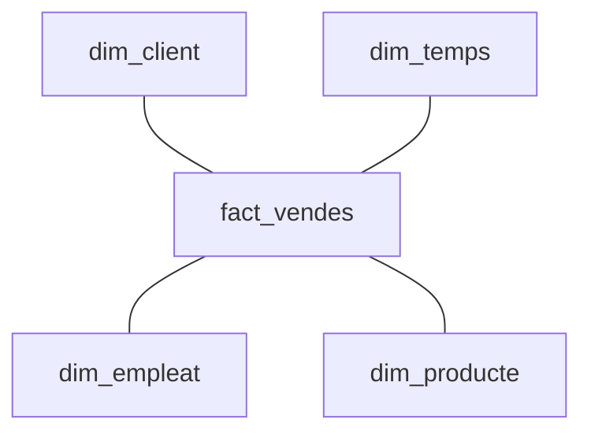
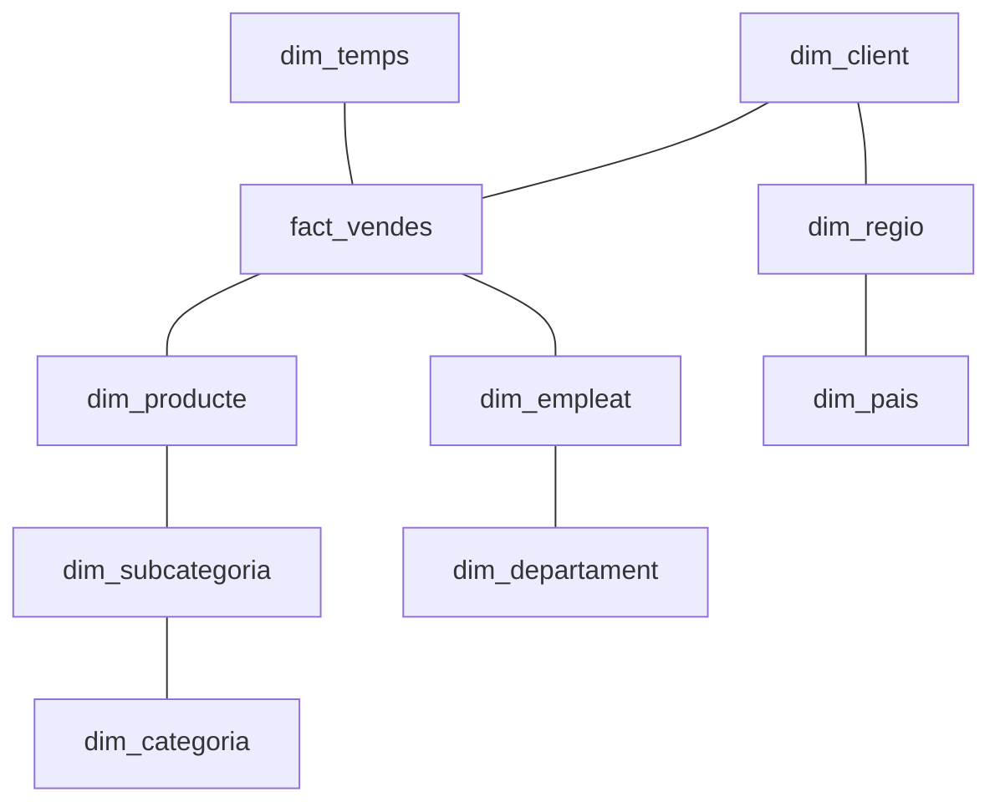

# :sparkles: Unitat de Treball. Emmagatzematge i Modelatge de dades

> Lectura exhaustiva per ampliar coneixements: ["The Data Warehouse Toolkit, Third Edition"](https://www.kimballgroup.com/data-warehouse-business-intelligence-resources/books/data-warehouse-dw-toolkit/) de Kimball i Ross.

## Contingut  
1. Magatzem de dades
2. Modelatge Dimensional
3. Esquemes de dades
4. Tècniques de Modelatge Dimensional
5. Consideracions i bones pràctiques

---

## 1. Magatzem de dades

Un **magatzem de dades** (_data warehouse_) és una base de dades que integra múltiples fonts, orientada a la consulta i l’anàlisi, i dissenyada per donar suport a la presa de decisions estratègiques. A diferència de les bases de dades transaccionals (_OnLine Transaction Processing_, OLTP), els magatzems de dades (_On-Line Analytical Processing_, OLAP) estan optimitzats per a consultes complexes i agregacions de dades.

Els magatzems de dades cumplixen les següents propietats:
- **Integrat**: dades procedents de múltiples fonts es combinen en un format coherent.
- **Orientat a temes**: organitzat per àrees de negoci (vendes, clients, inventari...).
- **No volàtil**: les dades no es modifiquen un cop carregades. Aquesta propietat es cumplix per a les condicions definides en els requisits d'actualització i retenció de dades.
- **Variant en el temps**: cada registre reflectix un moment temporal concret.

> Exemple: 
Un forn de venda de pa i dolços pot tindre un magatzem de dades amb informació històrica de comandes, clients, productes i visites web, per analitzar tendències de compra o rendiment de campanyes.  

> Per recordar les diferències entre OLTP i OLAP, l'article d'AWS: ["What’s the Difference Between OLAP and OLTP?"](https://aws.amazon.com/compare/the-difference-between-olap-and-oltp/)

---

## 2. Modelatge Dimensional

El modelatge dimensional és una metodologia per estructurar dades de manera que siguen fàcilment accessibles i comprensibles per a l’usuari final. Es basa en la separació de les dades entre:

- Fets (_facts_): dades quantitatives mesurables (com vendes, ingressos, temps de resposta).
- Dimensions: context descriptiu que dona significat als fets (com data, client, producte, ubicació).  

L'objectiu del modelatge dimensional és facilitar consultes analítiques ràpides, intuïtives i eficients, mitjançant una estructura senzilla i optimitzada per a la lectura (que no per a l’escriptura). El modelatge dimensional, per tant:

- Millora el rendiment de les consultes.
- Facilita la comprensió de les dades per part d’usuaris no tècnics.
- S’adapta bé a eines de visualització i anàlisi de dades.
- Permet una integració senzilla de dades històriques.

### Taules de fets (_FACT TABLE_)
Les taules de fets són el nucli central del model dimensional. Representen els esdeveniments mesurables d’un procés o activitat i contenen les mesures quantitatives que es volen analitzar. Cada fila (registre) representa un esdeveniment mesurable.  

Existixen diferents tipus de taules de fets:

| Tipus | Descripció | Exemple |
| ----- | ---------- | ------- |
| Fets transaccionals | Registres detallats d’esdeveniments | Cada comanda d'una tenda | 
| Fets _snapshot_ | Estat d’un sistema en un moment concret | Inventari diari agrupat |
| Fets acumulatius | Seguiment d’un procés al llarg del temps | Progrés d’un projecte |

<br>

> Exemple:
> Taula transaccional `fact_vendes`
> | id_venda | id_producte | id_client | id_temps | quantitat | import_total |
> |----------|-------------|-----------|----------|-----------|---------------|
> | 1        | 101         | 2001      | 20250101 | 3         | 45.00         |
> | 2        | 101         | 2002      | 20250101 | 4         | 60.00         |
> | 15       | 101         | 2001      | 20250122 | 1         | 15.00         |

### Taules de dimensions (_DIMENSION_)
Les taules de dimensions són taules descriptives que **proporcionen context descriptiu** a les dades emmagatzemades en les taules de fets. Són essencials per a la comprensió i l’anàlisi de les dades, ja que permeten filtrar, agrupar i explorar les mesures des de diferents perspectives. Contenen tots els atributs i jerarquies.  

Característiques principals:
- Descriptives: contenen atributs textuals o categòrics (ex: nom del producte, categoria, preu).
- Riques en atributs: solen tindre molts camps per facilitar l’anàlisi detallada.
- Estables: canvien amb menys freqüència que les taules de fets.
- Clau primària: cada fila té una clau única (`id_producte`).

Algunes de les dimensions més habituals són `temps`, `usuari`, `producte`, `ubicació`.

> Exemple:
> Taula `dim_producte`
> | id_producte | nom_producte    | categoria | preu_kg_euro  |
> |-------------|-----------------|-----------|---------------|
> | 101         | Pastís de llima | Pastís    | 7.5           |
> | 102         | Pa de quarta    | Pa        | 3.0           |

---

## 3. Esquemes de dades

En el modelatge de dades, els esquemes són estructures conceptuals que definixen com s’organitzen les dades dins d’una base de dades, especialment en el context d’un magatzem de dades. Aquestos esquemes representen la manera com les taules (tant de fets com de dimensions) es relacionen entre si per facilitar l’anàlisi i la consulta eficient de la informació.  

Un esquema és una representació gràfica o lògica de l’estructura d’una base de dades. Inclou:

- Les taules (fets i dimensions).
- Les relacions entre aquestes taules (claus primàries i foranes).
- L’organització jeràrquica de les dades.
- El nivell de normalització de les dimensions. La normalització s'explicarà més endavant.  

Així mateix, els esquemes cumplixen les següents funcions: 
- Faciliten la comprensió del model de dades.
- Optimitzen el rendiment de les consultes analítiques.
- Guien la implementació física de la base de dades.
- Permeten escalar el sistema a mesura que creixen les dades.

Existixen diferents tipus d'esquemes de dades. Els més utilitzats en el context dels magatzems de dades són l'_star_ i l'_snowflake_.

### "Esquema estrella" (_star schema_)

En aquest esquema, la taula de fets està al centre, i les dimensions es connecten a la taula de fets. A més, les dimensions estan desnormalitzades, és a dir, que contenen tota la informació necessària per a l’anàlisi, encara que això implique repetir dades.

Aquest esquema és eficient per a:
- Consultes ad hoc. 
- Consultes més ràpides, quan la rapidesa i el rendiment en la lectura són factors clau.
- Consultes senzilles, o quan la facilitat d'ús és una prioritat, sobretot per a usuaris no tècnics.
- Eines de BI i de visualització que requerixen d'una resposta quasi immediata.
- Crear dissenys senzills per a projectes de prova.

Per contra, no és recomanable quan:
- Les dimensions canvien a sovint, ja que aquest esquema dificulta el seu manteniment.
- Es requerix un emmagatzematge eficient, sobretot quan es tracta de grans volums de dades.

> Exemple


### "Esquema cop de neu" (_snowflake schema_)

Aquest esquema seguix els principis de normalització (1NF, 2NF, 3NF, 4NF o 5NF), millorant la integritat de les dades i reduint la duplicació, però a costa de la simplicitat i el rendiment en la lectura.

L'esquema _snowflake_ és útil quan:
- La normalització aporta beneficis a l'arquitectura del magatzem de dades (per exemple, quan les dimensions tenen atributs repetits, la normalització reduïx l'espai d'emmagatzematge).
- Quan les dimensions canvien freqüentment, ja que és més senzill actualitzar una sola taula normalitzada que moltes amb dades duplicades.
- Si les dimensions tenen jerarquies naturals, ja que la representació és més clara i estructurada. Per exemple, ciutat &rarr; comunitat &rarr; país.
- Quan és necessari un control més granular i exhaustiu de l'accés a les dades.
- Quan les dades provenen de sistemes ja normalitzats.
- Quan l'eficiència en l'espai i el manteniment són factors clau.

Per contra, no és recomanable quan:
- Es servirà a usuaris no tècnics, per la seua complexitat.
- S'usa en conjunt amb eines de visualització o BI que requerisquen de temps de resposta quasi immediats. 
- Es requeix rapidesa de lectura per a anàlisis complexes, ja que calen més unions entre taules i les consultes són més lentes i complexes.

**Exemple:**
`dim_producte` → `dim_subcategoria` → `dim_categoria`


### Comparativa entre els esquemes _star_ i _snowflake_

| **Aspecte** | **Esquema Estrella** | **Esquema Cop de Neu** |
|-------------|----------------------|-------------------------|
| **Estructura** | Dimensions desnormalitzades directament connectades a la taula de fets. | Dimensions normalitzades amb subtaules jeràrquiques. |
| **Simplicitat** | Més senzill de dissenyar i entendre. | Més complex, especialment per a usuaris no tècnics. |
| **Rendiment de consultes** | Consultes més ràpides per la menor quantitat de `JOIN`. | Consultes més lentes per l’ús de múltiples `JOIN`. |
| **Redundància de dades** | Alta redundància (atributs repetits en dimensions). | Baixa redundància (atributs separats en subtaules). |
| **Manteniment** | Més difícil de mantindre si hi ha canvis en les dimensions. | Més fàcil de mantindre i actualitzar. |
| **Espai d’emmagatzematge** | Pot requerir més espai per la desnormalització. | Més eficient en espai gràcies a la normalització. |
| **Exemple típic** | `dim_producte` conté `nom`, `subcategoria`, `categoria`. | `dim_producte` → `dim_subcategoria` → `dim_categoria`. |
| **Casos d’ús recomanats** | Entorns on la simplicitat i la velocitat de consulta són prioritàries (BI, _dashboards_). | Entorns amb grans volums de dades i necessitat de manteniment estructurat. També si el control d'accés ha de ser molt granular i exhaustiu. |

> Per ampliar coneixements sobre les diferències entre els esquemes _star_ i _snowflake_: article a DataCamp ["Star Schema vs Snowflake Schema"](https://www.datacamp.com/blog/star-schema-vs-snowflake-schema)

---

## 4. Tècniques de Modelatge Dimensional

El modelatge dimensional segons Kimball seguix una metodologia estructurada per garantir que el magatzem de dades siga útil, escalable i fàcil d’utilitzar. Aquestes tècniques es poden aplicar a qualsevol procés que es puga mesurar.

#### Pas 1. Identificació del procés de negoci  
Seleccionar un procés mesurable i rellevant que es puga analitzar mitjançant dades. És recomanable triar processos que siguen freqüents i repetitius, i prioritzar processos estratègics per a l’organització.  

Exemples: vendes, comandes, trucades de suport.

#### Pas 2: Definició del granulat
Determinar el **nivell de detall** de cada fila de les taules de fets, que determinarà quines mesures es podran calcular i en funció de quines dimensions. És recomanable que el granulat siga consistent amb les dimensions disponibles.   

Exemples: una fila per cada línia de comanda o una fila per cada dia i producte.

#### Pas 3: Identificació de dimensions
Determinar les taules que proporcionaran context als fets, i els atributs i jerarquies que les conformaran. Les dimensions són essencials per a la navegació analítica en la visualització de dades i BI (_drill-down_, _breakdown_), ja que permeten:
- Filtrar: “Mostra’m les vendes del producte X”.
- Agrupar: “Agrupa les vendes per categoria de producte”.
- Ordenar: “Ordena per data de compra”.
- Explorar jerarquies: “Desglossa per país &rarr; regió &rarr; ciutat”.

És recomanable:
- Utilitzar claus substitutives (_surrogate keys_) per evitar dependències de claus naturals.
- Incloure atributs derivats útils per a l’anàlisi (ex: edat calculada a partir de la data de naixement).
- Evitar atributs amb valors nuls o amb significat ambigu.
- Documentar les jerarquies (ex: categoria &rarr; subcategoria &rarr; producte).

Exemples: 
- `Temps` (`dia`, `mes`, `any`)
- `Client` (`id_client`, `nom`, `DNI`, `email`, `codi_postal`)
- `Producte` (`id_producte`, `nom`, `categoria`, `preu`)
- `Tenda` (`id_tenda`, `nom`, `codi_postal`)

#### Pas 4: Definició de mesures
Seleccionar mesures **aditives** (es poden sumar), **semiaditives** (es poden sumar parcialment) o **no additives**. És recomanable incloure mesures netes i derivades (ex: import_total = quantitat × preu_unitari), evitar mesures amb significat ambigu i documentar clarament el significat de cada mesura.

**Exemples:**
- Additiva: `quantitat`, `import_total`
- Semiaditiva: `saldo` (només té sentit sumar-lo per períodes iguals)
- No additiva: `percentatge`, `mitjana`

#### Pas 5. Disseny de les taules de fets
Tenint en compte:
- Claus foranes cap a les dimensions (`id_producte`, `id_client`). Es pot reforçar la integritat amb restriccions de clau forana.
- Mesures numèriques (`quantitat`, `ìmport_total`).
- Claus substitutives (_surrogate keys_) per identificar de manera única les files (registres), si cal (`id`).

Exemple:
```sql
CREATE TABLE fact_vendes (
  id SERIAL PRIMARY KEY,
  id_producte INT,
  id_client INT,
  id_temps DATE,
  id_botiga INT,
  quantitat INT,
  import_total NUMERIC
);
```

#### Pas 6. Tractament de dades temporals i canvis en dimensions
En un magatzem de dades, les dimensions (com client, producte, empleat, etc.) poden canviar amb el temps. Per exemple:

- Un client canvia d’adreça.
- Un producte canvia de categoria.
- Un empleat canvia de departament.

Aquestos canvis s’han de gestionar de manera que les anàlisis històriques siguen coherents i precises. Per això, s’utilitzen les anomenades SCD (Slowly Changing Dimensions), o dimensions de canvi lent.  

Consideracions:
- Cal afegir claus substitutives (_surrogate keys_) per identificar cada versió d’una dimensió.
- Les taules de fets han d’enllaçar amb la versió correcta de la dimensió segons la data de l’esdeveniment.
- És habitual usar detonants o procediments (com als ETL) per gestionar automàticament els canvis.

##### SCD Tipus 1 – Sobreescriptura
- El valor antic es substituïx pel nou.
- No es conserva l’històric.
- Útil quan els canvis no afecten l’anàlisi històrica.  

Exemple: Un client canvia el seu número de telèfon. No cal conservar l’antic.

```sql
UPDATE dim_client
SET telefon = '612345678'
WHERE id_client = 101;
```

##### SCD Tipus 2 – Històric complet
- Es crea una nova fila amb el nou valor.
- Es conserva l’històric complet.
- S’afegixen camps com `data_inici`, `data_fi`, `actiu`.  
- Permet anàlisi històrica precisa.  

Exemple: Un client canvia de ciutat. Es vol saber on vivia en cada moment.

```sql
-- Fila antiga
id_client | nom     | ciutat     | data_inici | data_fi     | actiu
101       | Maria   | València   | 2022-01-01 | 2024-03-15  | FALSE

-- Nova fila
102       | Maria   | Alacant    | 2024-03-16 | NULL        | TRUE
```
##### SCD Tipus 3 – Valor anterior
- Es guarda el valor actual i l’anterior en la mateixa fila.
- No es conserva tot l’històric, només l’últim canvi.
- Només permet fer el seguiment d'un canvi.  

Exemple: Un client canvia de ciutat, però només cal guardar una adreça anterior.

```sql
id_client | nom   | ciutat_actual | ciutat_anterior
101       | Maria | Alacant       | València
```

#### Pas 7. Validació i iteració
Amb l'objectiu de comprovar que el model:
- Reflectix correctament el procés de negoci.
- És comprensible per als usuaris.
- Permet consultes eficients, en funció dels requeriments establerts.

Per a això, es poden seguir els següents mètodes:
- Prototipat amb dades reals.
- Revisió amb usuaris.
- Execució de consultes típiques.

---

## 5. Consideracions i bones pràctiques

### Normalització vs. desnormalització
- **Desnormalització**: preferida per millorar la velocitat de consulta.
- **Normalització**: útil per a manteniment i integritat, però pot penalitzar el rendiment.

### Seguretat i control d’accés
- Definició i implementació de rols i permisos, seguint els principis definits per l'estratègia de governança de dades de l'entitat.
- Restricció d’accés a dades sensibles (ex: dades personals).

### Índexs i optimització
- Implementació d'índexs en claus foranes i camps de consulta habituals.

> Per recordar els tipus de claus, l'article ["Types of keys"](https://www.bbc.co.uk/bitesize/guides/z4wf8xs/revision/4)  
> Per recordar què és la indexació, l'article ["What is a Database Index?"](https://www.codecademy.com/article/sql-indexes)  
> Índexació de manera exhaustiva, a ["Indexing in databases"](https://www.geeksforgeeks.org/indexing-in-databases-set-1/)

### Vistes materialitzades
- Creació de **vistes materialitzades** per millorar el rendiment de consultes agregades en la fase analítica.

> Exemple
>```sql
>CREATE MATERIALIZED VIEW vendes_per_categoria AS
>SELECT p.categoria, SUM(f.import_total)
>FROM fact_vendes f
>JOIN dim_producte p ON f.id_producte = p.id_producte
>GROUP BY p.categoria;
>```