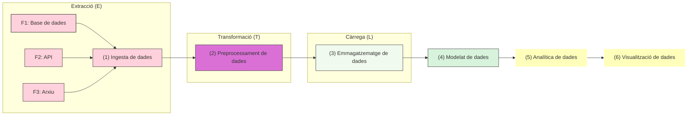

# :sparkles: Introducció al _Big Data_ i a l'aprofitament de dades

## 1. Què és el _Big Data_?

El ***Big Data*** fa referència al tractament de conjunts de dades que tenen grans volums, o que s'han de processar a gran velocitat, o que tenen gran complexitat. Durant els inicis de l'era del _Big Data_, les eines tradicionals de gestió de dades no eren suficients per gestionar aquestes dades de manera eficient, i es van desenvolupar eines específiques que resolien les problemàtiques principals de la gestió d'aquestos conjunts de dades. Però en el camp de les dades, l'objectiu no és emmagatzemar-les en si, sinó més bé extraure'n valor per prendre decisions més informades, automatitzar processos o descobrir patrons ocults, entre altres. És a dir, l'objectiu és l'**aprofitament de les dades**. A més, la majoria de les tècniques i destreses necessàries en l'àmbit de les dades són independents de si estem tractant amb [_Big_, _Medium_ o _Small Data_](https://medium.com/@thibaut_gourdel/data-sizes-matter-small-medium-big-6303ed48ea26), i és habitual començar els projectes a una escala menor i augmentar-ne el volum i la complexitat amb el temps.  

### Les V del _Big Data_

Si bé totes aquestes característiques no són exclussives del _Big Data_, ajuden a entendre la complexitat que implica la seua gestió:

- **Varietat**: Diversitat de fonts i tipus (dades estructurades, semiestructurades i no estructurades).
- **Volum**: Quantitat massiva de dades generades per sensors, xarxes socials, dispositius mòbils, etc.
- **Velocitat**: Ritme amb què es generen i processen les dades, incloent dades en _temps real_.
- **Veracitat**: Qualitat i fiabilitat de les dades.
- **Valor**: Capacitat d’extraure coneixement útil de les dades per a la presa de decisions.
- **Viabilitat**: Capacitat de l'entitat per gestionar les dades i extraure'n valor.
- **Visualització**: Representació de les dades en forma gràfica o amb mètriques/indicadors per facilitar-ne la interpretació.

### La importància de l'aprofitament de les dades

Per exemple, per a...

- Detectar patrons de comportament dels clients.
- Optimitzar processos industrials.
- Predir fallades en maquinària.
- Personalitzar serveis.
- Prendre decisions basades en dades reals i no en intuïcions.

És a dir, que saber fer ús de les dades que es generen en una activitat (comercial o no) és una competència essencial en qualsevol àmbit professional en l'actualitat, tenint en compte que tota activitat genera dades i que la gran majoria d'aquestes dades són digitals o poden digitalitzar-se.

> Per ampliar coneixements sobre problemàtiques encara actuals respecte a ferramentes i plataformes de gestió de dades: ["The Problem is Medium Data"](https://highscalability.com/the-big-problem-is-medium-data/)

---

## 2. Cicle de vida de les dades
Data lifecycle

https://aitor-medrano.github.io/iabd/de/de.html#ciclo-de-vida

https://aitor-medrano.github.io/iabd/de/de.html#ingesta

---

## 3. Fases d’un sistema d'aprofitament dades

Un sistema d'aprofitament de dades complet inclou els següents blocs:

1. **Ingesta de dades**: Captura des de múltiples fonts (APIs, arxius, bases de dades, sensors...). <mark>_Aquestes destreses es treballaran en la Unitat de Treball 1_</mark>.
2. **Prepocessament**: Revisió, neteja i validació de les dades. <mark>_Aquestes destreses es treballaran en la Unitat de Treball 1 i 2_</mark>.
3. **Emmagatzematge**: Integració de les dades en bases de dades relacionals o altres sistemes, creant Magatzems de dades (_Data Warehouse_) o Llacs de dades (_Data Lake_). <mark>_Aquestes destreses es treballaran en la Unitat de Treball 3_</mark>.
4. **Modelat**: Creació de models de dades que les integren, agrupen i relacionen, en formats diferents en funció de l'objectiu analític i/o de visualització (OLAP, esquema estrella...).  <mark>_Aquestes destreses es treballaran en la Unitat de Treball 3_</mark>.
5. **Analítica**: Ampliació del model amb dades derivades, en preparació de les representacions gràfiques o del càlcul d'indicadors de progrés. <mark>_Aquestes destreses es treballaran en la Unitat de Treball 4_</mark>.
6. **Visualització**: Quadres de comandament (_dashboards_), informes d'intel·ligència de negoci (BI) i alertes que permeten visualitzar, interpretar i monitoritzar les dades i els indicadors definits. <mark>_Aquestes destreses es treballaran en la Unitat de Treball 5_</mark>.

Aquestes fases es connecten entre si formant un **flux de dades** que va des de les fonts fins a la presa de decisions, una vegada s'han interpretat les dades. Tots aquestos conceptes s'estudiaran amb profunditat en les Unitats de Treball referides.  

<mark> REVISAR ESTIL</mark>

---
## 4. Sistemes d'emmagatzematge

Data warehouse, Data lake
https://aitor-medrano.github.io/iabd/de/de.html#almacenamiento

---

## 5. Gestió de dades i Governança de dades
https://aitor-medrano.github.io/iabd/de/de.html#areas-transversales

---
## 6. Rols associats al món professional 

<mark>Intro + relació amb projecte</mark>

#### Arquitectura de dades

#### Enginyeria de dades

#### Anàlisi de dades

#### Ciència de dades

#### Intel·ligència de Negoci (BI)

#### Gestió de Dades i Governança de Dades
## 🧠 3. Data Management: gestió eficient del cicle de vida del dada

La **gestió de dades** implica controlar tot el cicle de vida del dada: des de la seua creació fins a la seua eliminació.

### Bones pràctiques:

- Documentar l’origen i les transformacions aplicades (metadades).
- Controlar versions dels conjunts de dades.
- Establir polítiques de retenció i arxiu.
- Automatitzar processos de validació i control de qualitat.

> 📁 Exemple: mantenir un registre de quan i com s’ha modificat un camp de “categoria de producte”.

#### Altres
DPO

---
https://aitor-medrano.github.io/iabd/de/de.html#herramientas-base
