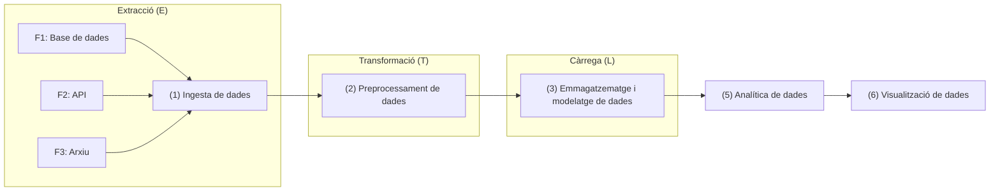

# :sparkles: Introducció al _Big Data_ i a l'aprofitament de dades

## 1. Què és el _Big Data_?

El ***Big Data*** fa referència al tractament de conjunts de dades que tenen grans volums, o que s'han de processar a gran velocitat, o que tenen gran complexitat. Durant els inicis de l'era del _Big Data_, les eines tradicionals de gestió de dades no eren suficients per gestionar aquestes dades de manera eficient, i es van desenvolupar eines específiques que resolien les problemàtiques principals de la gestió d'aquestos conjunts de dades. Però en el camp de les dades, l'objectiu no és emmagatzemar-les en si, sinó més bé extraure'n valor per prendre decisions més informades, automatitzar processos o descobrir patrons ocults, entre altres. És a dir, l'objectiu és l'**aprofitament de les dades**. A més, la majoria de les tècniques i destreses necessàries en l'àmbit de les dades són independents de si estem tractant amb [_Big_, _Medium_ o _Small Data_](https://medium.com/@thibaut_gourdel/data-sizes-matter-small-medium-big-6303ed48ea26), i és habitual començar els projectes a una escala menor i augmentar-ne el volum i la complexitat amb el temps.  

### Les V del _Big Data_

Si bé totes aquestes característiques no són exclussives del _Big Data_, ajuden a entendre la complexitat que implica la seua gestió:

- **Varietat**: Diversitat de fonts i tipus (dades estructurades, semiestructurades i no estructurades).
- **Volum**: Quantitat massiva de dades generades per sensors, xarxes socials, dispositius mòbils, etc.
- **Velocitat**: Ritme amb què es generen i processen les dades, incloent dades en _temps real_.
- **Veracitat**: Qualitat i fiabilitat de les dades.
- **Valor**: Capacitat d’extraure coneixement útil de les dades per a la presa de decisions.
- **Viabilitat**: Capacitat de l'entitat per gestionar les dades i extraure'n valor.
- **Visualització**: Representació de les dades en forma gràfica o amb mètriques/indicadors per facilitar-ne la interpretació.

### La importància de l'aprofitament de les dades

Per exemple, per a...

- Detectar patrons de comportament dels clients.
- Optimitzar processos industrials.
- Predir fallades en maquinària.
- Personalitzar serveis.
- Prendre decisions basades en dades reals i no en intuïcions.

És a dir, que saber fer ús de les dades que es generen en una activitat (comercial o no) és una competència essencial en qualsevol àmbit professional en l'actualitat, tenint en compte que tota activitat genera dades i que la gran majoria d'aquestes dades són digitals o poden digitalitzar-se.

> Per ampliar coneixements sobre problemàtiques encara actuals respecte a ferramentes i plataformes de gestió de dades: ["The Problem is Medium Data"](https://highscalability.com/the-big-problem-is-medium-data/)

---

## 2. Cicle de vida de les dades

El cicle de vida de les dades (_data lifecycle_) és el conjunt de fases que seguixen les dades des del moment en què es generen o s’adquirixen fins que es descarten o s’arxiven. Aquest concepte és fonamental en la gestió de dades, ja que ajuda a garantir-ne la qualitat, la seguretat, la legalitat dels processos implicats i l’aprofitament eficient al llarg del temps.  

Tot i que pot variar lleugerament segons el context, el cicle de vida de les dades generalment inclou les següents etapes:

1. Creació o adquisició  
Les dades es generen (ex: sensors, formularis, transaccions) o s’obtenen d’altres fonts (ex: APIs, bases de dades externes).  
És clau assegurar la qualitat i la integritat des del primer moment.
2. Emmagatzematge  
Les dades es guarden en sistemes adequats (bases de dades, llacs de dades, magatzems de dades).  
Cal garantir la seguretat, la disponibilitat i el compliment normatiu (ex: RGPD).
3. Processament  
Es netegen, transformen i estructuren per fer-les útils.  
Inclou operacions com: normalització, integració, deduplicació, etc.
4. Anàlisi i ús  
Les dades es consulten i s’analitzen per extraure'n coneixement.  
Pot incloure: informes, _dashboards_, models predictius, etc.
5. Compartició  
Les dades o els resultats de l’anàlisi es distribuïxen a usuaris o sistemes.  
És important controlar-ne l’accés i garantir-ne la traçabilitat.
6. Arxivament o eliminació  
Quan les dades ja no són útils, es poden:  
    - Arxivar per a ús futur o per obligacions legals.  
    - Eliminar de manera segura per evitar riscos de privacitat o seguretat.

  

---

## 3. Fases d’un sistema d'aprofitament dades

Un sistema d'aprofitament de dades complet inclou els següents blocs:

1. **Ingesta de dades**: Captura des de múltiples fonts (APIs, arxius, bases de dades, sensors...). <mark>_Aquestes destreses es treballaran en la Unitat de Treball 1_</mark>.
2. **Prepocessament**: Revisió, neteja i validació de les dades. <mark>_Aquestes destreses es treballaran en la Unitat de Treball 2_</mark>.
3. **Emmagatzematge i Modelatge**: Integració de les dades en bases de dades relacionals o altres sistemes, creant Magatzems de dades (_Data Warehouse_). Creació de models de dades que les integren, agrupen i relacionen, en formats diferents en funció de l'objectiu analític i/o de visualització. <mark>_Aquestes destreses es treballaran en la Unitat de Treball 3_</mark>.
4. **Analítica**: Ampliació del model amb dades derivades, en preparació de les representacions gràfiques o del càlcul d'indicadors de progrés. <mark>_Aquestes destreses es treballaran en la Unitat de Treball 4_</mark>.
5. **Visualització**: Quadres de comandament (_dashboards_), informes d'intel·ligència de negoci (BI) i alertes que permeten visualitzar, interpretar i monitoritzar les dades i els indicadors definits. <mark>_Aquestes destreses es treballaran en la Unitat de Treball 5_</mark>.

Aquestes fases es connecten entre si formant un **flux de dades** que va des de les fonts fins a la presa de decisions, una vegada s'han interpretat les dades. Tots aquestos conceptes s'estudiaran amb profunditat en les Unitats de Treball referides.  

---
## 4. Sistemes d'emmagatzematge

La taula següent compara els sistemes "magatzem de dades" o **Data Warehouse**, i "llac de dades" o **Data Lake**, destacant les seues diferències principals en diversos aspectes clau:

| **Aspecte**                     | ***Data Warehouse***                                                                 | ***Data Lake***                                                                 |
|----------------------------------|------------------------------------------------------------------------------------|--------------------------------------------------------------------------------|
| **Tipus de dades**              | Principalment, dades estructurades (SQL, taules relacionals)                                     | Dades estructurades, semiestructurades i no estructurades (JSON, imatges, logs, etc.) |
| **Modelatge**                   | Modelatge previ (esquemes definits: _star_, _snowflake_)                         | Sense modelatge previ (esquema en lectura: *schema-on-read*)                  |
| **Finalitat principal**         | Anàlisi empresarial, informes, BI                                                 | Emmagatzematge massiu, ciència de dades, altres aplicacions d'IA                    |
| **Temps de preparació de dades**| Alt (ETL: extracció, transformació i càrrega abans de l’ús)                       | Baix (ELT: les dades es carreguen i es processen quan cal)                    |
| **Rendiment de consultes**      | Alt per a consultes estructurades i agregacions, depenent de l'esquema                                   | Variable; depén del format i volum de dades                                   |
| **Cost d’emmagatzematge**      | Més elevat (optimitzat per a rendiment), però depén de l'esquema                                           | Més econòmic (emmagatzematge massiu en brut)                                  |
| **Tecnologies habituals**       | PostgreSQL, Snowflake, Amazon Redshift, Google BigQuery                          | Hadoop, Amazon S3, Azure Data Lake, Apache Spark                              |
| **Governança i qualitat**       | Alta governança i control de qualitat                                             | Potencialment menys controlat si no es gestiona bé                            |
| **Usuaris principals**          | Analistes de dades, responsables de negoci, aplicacions d'IA                                        | Científics de dades                                       |

---

## 5. Gestió de dades i Governança de dades

La **gestió de dades i la governança de dades són dos conceptes fonamentals en qualsevol projecte d’aprofitament de dades**, especialment quan es treballa amb grans volums d’informació.  

La **gestió de dades** fa referència al conjunt de processos, eines i pràctiques utilitzades per recollir, emmagatzemar, organitzar, protegir i mantindre les dades al llarg del seu cicle de vida, amb l'objectiu de **garantir que les dades estiguen disponibles, siguen fiables i útils per a l’organització**.  

Inclou:
- Integració i qualitat de dades
- Emmagatzematge i accés eficient
- Seguretat i còpies de seguretat
- Preparació per a l’anàlisi

D'altra banda, la **governança de dades** engloba el marc de normes, rols, polítiques i responsabilitats que asseguren que les dades siguen gestionades de manera coherent, segura i alineada amb els objectius de l'entitat; és a dir, va un pas més enllà de la gestió de dades per garantir que el seu ús siga ètic i regulat.  

Inclou:
- Definició de rols (ex: propietari de dades, administrador de sistema que gestiona dades)
- Normatives d’ús i accés
- Compliment legal (ex: RGPD)
- Qualitat i traçabilitat de les dades

Sense una bona gestió i governança:

- Les dades poden ser incompletes, duplicades o incorrectes.
- Es poden produir errors en l’anàlisi i la presa de decisions.
- Es poden incomplir normatives legals, amb conseqüències greus.
- Es dificulta la confiança en els resultats i la col·laboració entre equips.

Amb una gestió i governança sòlides:

- Es maximitza el valor estratègic de les dades.
- Es millora la qualitat de les decisions.
- Es reduïxen riscos i costos operatius.

> Per ampliar coneixements sobre la gestió de dades i la seua importància: la guia ["A Comprehensive Guide
to Data and AI Governance"](https://www.databricks.com/sites/default/files/2024-08/comprehensive-guide-to-data-and-ai-governance.pdf).

---
## 6. Rols i àmbits associats al món professional 

- Arquitectura de dades
- Enginyeria de dades
- Administració de sistemes
- Anàlisi de dades
- Ciència de dades
- Enginyeria de la Intel·ligència de Negoci (BI)
- Gestió de Dades i Governança de Dades
- Responsable de producte
- Altres
    - _Data Protection Officer_
    - _Chief Data Officer_

---

