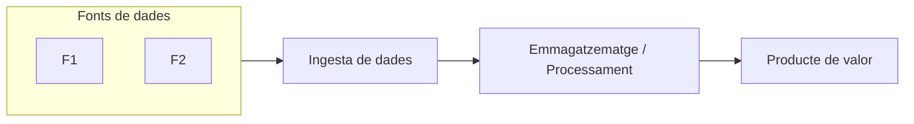

# :sparkles: Unitat de Treball 1. Ingesta de dades

## 1. Què és la ingesta de dades?  

Formalment, la **ingesta de dades** és el procés mitjançant el qual s’introduïxen dades, procedents de diferents fonts, estructures i/o característiques, dins d’un altre sistema d’emmagatzematge o de processament de dades.

Totes les fases d'un sistema d'aprofitament de dades tenen la mateixa importància, incloent la ingesta de dades, ja que l'eficiència de cada part del procés condiciona l'eficiència del sistema complet. La ingesta de dades, per tant, ha de ser **flexible i àgil**, de manera que proporcione les dades en terminis acceptables, i en formats i procediments coherents.  

La ingesta es pot executar en intervals temporals o en blocs de dades (seleccionant elements concrets a les dades o volums predefinits). També es pot realitzar de manera que tota la font d'origen es copie en cada ingesta (_snapshots_) o que únicament es traslladen els canvis que hi haja hagut en l'origen des de l'anterior ingesta (és a dir, de manera incremental). Els requeriments del projecte guiaran o condicionaran la configuració de la ingesta.  

### Estratègies d'ingesta

| ***Push*** | ***Pull*** | ***Poll*** |
| ---------- | ---------- | ---------- |
| L'origen envia les dades a la destinació | La destinació demana l'enviament de dades a l'origen | La destinació comprova si hi ha hagut canvis en les dades d'origen, i en cas afirmatiu, executa un _pull_ |

---

## 2. Què és un _pipeline_ de dades?

S’entén per ***pipeline* de dades** cada procés que consumix dades des d’un punt d’origen, les processa i valida, i les escriu en un nou destí. És una construcció lògica que representa un procés dividit en fases. Es caracteritza per definir:

- El conjunt de passos o etapes que descriuen el moviment o processament de dades.
- Les tecnologies implicades en el procés.

Simplificant, un _pipeline_:

1. Recull les dades.
2. Les emmagatzema i les processa.
3. Construïx _alguna cosa útil_ amb les dades.  

Els _pipelines_ són necessaris perquè **no s’haurien d’analitzar les dades en els mateixos sistemes on es generen**, per evitar problemes de rendiment, ja que l’anàlisi és costosa computacionalment.

### Disseny d’un _pipeline_ de dades

Per dissenyar l'arquitectura d'un _pipeline_ de dades cal tindre en compte:

- El tipus i la font de les dades.
- L’objectiu final del projecte.
- Què es vol aconseguir amb aquestes dades.

És a dir, que el disseny d’un _pipeline_ hauria de començar pel **problema de negoci** que es vol resoldre, i anar retrocedint fins a l’origen de les dades. Aquesta anàlisi inicial és fonamental per determinar les tecnologies que formaran part de l’arquitectura.  

---

## 3. ETL: Extracció, Transformació i Càrrega

Tot i que sovint s’intercanvien els termes _pipeline_ de dades i **ETL**, no són el mateix. Els ETL són un cas particular de _pipeline_ que inclou les fases d’extracció (_Extract_), transformació (_Transform_) i càrrega (_Load_) de dades. En canvi, un _pipeline_ pot ser qualsevol procés que implique moviment de dades entre sistemes.

Els ETL permeten recopilar totes les dades generades per múltiples fonts en un únic lloc. Com que aquestes dades provenen de fonts diverses, és necessari aplicar uns procediments per poder integrar-les conjuntament, així com per assegurar-ne la qualitat i la veracitat.  

### Extracció

La fase d’extracció consistix a recopilar les dades dels sistemes originals i transportar-les al sistema on s’emmagatzemaran i es processaran, habitualment, un magatzem de dades, preparant-les per iniciar-ne la transformació.

Les fonts poden ser molt variades: fitxers de qualsevol format, bases de dades relacionals, registres de sistema (_logs_)...

Les característiques desitjables d’un procés d’extracció són:

1. Rapidesa i lleugeresa: Ha de causar el menor impacte possible i ser transparent per als sistemes operacionals.
2. Seguretat: No ha de posar en risc el sistema origen ni modificar-ne les dades.

### Eines ETL

Els processos ETL poden implementar-se amb eines diverses, però es recomana que aquestes cumplisquen les característiques següents:

- Flexibles i compatibles amb formats diversos, amb connectors per a múltiples fonts i destinacions de dades:
  - Excel, bases de dades, XML, fitxers CSV / JSON, HDFS, Hive, S3...
  - Peticions HTTP, serveis REST...
  - APIs d’aplicacions de tercers, logs...
- Escalables
- Que permeten la planificació mitjançant l'execució per lots (*batch*), per esdeveniments o en "temps real" (*streaming*)
- Capacitat de transformació de les dades
    - Transformacions simples: tipus de dades, cadenes, codificacions, càlculs bàsics.
    - Transformacions intermèdies: agregacions, recerques (*lookups*).
    - Transformacions complexes: algorismes d’IA, segmentació, integració de codi extern o altres llenguatges.
- Metadades i gestió d’errors
    - Permeten monitoritzar el funcionament del procés.
    - Gestionen errors i definixen accions automàtiques quan es produïxen.

Algunes eines populars en l'actualitat...
- Eines de codi obert
    - Apache NiFi
    - Talend Open Studio
    - Pentaho Data Integration
    - Apache Spark
- Eines comercials
    - Informatica Data Integration
    - Microsoft SQL Server Integration Services (SSIS)
    - Oracle Data Integrator
    - Google Cloud Dataflow
    - Azure Data Factory

### *Batch* vs *Streaming*   

_Batch_. El procés ETL s'executa en intervals de temps definits (normalment, de forma periòdica). Eficient quan la latència entre la generació de noves dades a les fonts i el seu aprofitament no és un factor crític. La duració del procés incrementa amb el volumn de les dades (durant la ingesta) i la complexitat de les seues relacions o dels càlculs (durant les fases posteriors). Algunes eines utilitzades són: Apache Sqoop, _jobs_ de MapReduce o de Spark, _scripts_ de Python... <mark> En el projecte utilitzarem Python</mark>.   

_Streaming_. El procés s'executa sempre que hi ha noves dades disponibles, ja que la latència és un factor clau en aquest cas. És conegut com a "en temps real", encara que el procés no és immediat, ja que el temps d'execució és el mínim possible. Algunes eines utilitzades són: Apache Storm, Spark Streaming, Apache Nifi, Apache Kafka,...

## 4. ELT: Extracció, Càrrega i Transformació

L’**ELT** canvia l’ordre de les sigles respecte a l’ETL i es basa en **extraure, carregar i transformar**. És una tècnica d’ingesta de dades on les dades obtingudes des de múltiples fonts es col·loquen sense transformar directament en el sistema destí d'emmagatzematge. A partir d’ací, les dades es poden transformar segons els diferents objectius del negoci.  

La següent taula resumix les diferències entre els processos ETL i ELT:
| **Característica** | **ETL** | **ELT** |
| ---------------------------------- | --------------------------------------------------------------------- | ---------------------------------------------------------------------- |
| **Ordre del procés**               | Extracció → Transformació → Càrrega                                   | Extracció → Càrrega → Transformació                                    |
| **Lloc on es fa la transformació** | Fora del sistema de destinació (normalment en un servidor ETL extern) | Dins del sistema de destinació (data warehouse o data lake)            |
| **Temps de processament**          | Pot ser més lent amb grans volums de dades                            | Pot ser més ràpid gràcies a la potència del sistema de destinació      |
| **Complexitat de dades**           | Ideal per a dades estructurades i netes                               | Millor per a grans volums i dades semiestructurades o no estructurades |
| **Tecnologia habitual**            | Utilitza eines ETL dedicades (com Talend, Informatica, Pentaho)       | Utilitza capacitats del sistema de destinació (SQL, Spark, BigQuery)   |
| **Control i qualitat de dades**    | Alt control abans de carregar les dades                               | Es poden carregar dades brutes; es netegen després                     |
| **Casos d’ús habituals**           | Sistemes tradicionals de BI i informes                                | Anàlisi de big data, machine learning, entorns cloud                   |

---

## 5. Consideracions per a l’arquitectura d’ingesta

### Origen i format de les dades

- Quines són les fonts? Quines característiques tenen? Aplicacions, APIs, IoT?
- Són internes o externes?
- Són estructurades o no estructurades?
- Quin volum tenen? A quina velocitat es generen noves dades? (events/segon, GB/hora)
- S’incorporaran noves fonts en el futur?
- Quin és l'esquema de les dades?
- Cal fer _joins_ entre sistemes per tindre una visió completa?

### Latència i disponibilitat

- Quina importància té la rapidesa d’ingesta?
- Es necessita processament per lots (hores/dies) o en temps real?
- Fins quan són vàlides les dades si arriben tard?

### Actualitzacions

- Les fonts canvien a sovint?
- Com es comuniquen els canvis d’estructura en les fonts? (ex. inserció d'una nova columna en una taula)
- És necessari mantindre un històric de canvis? Fins a quan?
- És possible reutilitzar les dades per evitar tornar a ingerir múltiples versions de les mateixes dades?
- Modifiquem les dades que havíem ingerit prèviament? Amb quins mètodes? (_updates_ o _delete_ + _insert_)

### Transformacions

- Són necessàries durant la ingesta?
- Introduïxen latència o afecten el rendiment del sistema d'origen?
- És acceptable transformar les dades o cal mantindre les originals?
- En _streaming_, cal transformar les dades "al vol"?
- Quins procediments de transformació es realitzaran una vegada ingerides les dades?

### Destinació de les dades

- El sistema d’emmagatzematge compleix amb els requisits de latència (lectura i escriptura) i de velocitat?
- S’utilitzarà un sistema amb (Snowflake) o sense suport per a consultes (S3)?
- Cal enviar les dades a múltiples destins?
- S'utilitzarà el mateix format per emmagatzemar les dades que en origen?
- Com s’utilitzaran les dades en el sistema destinació? Cal particionar-les? 
- En el sistema destinació, es realitzaran consultes recurrents, o ad hoc i aleatòries?
- Fins a quan (moment temporal o de volum) cal guardar les dades detallades? A partir de quin moment es poden guardar les dades "resumides"? 
- Fins a quan cal guardar les dades? (política de retenció de dades)

### Característiques de les dades

- Hi ha errors en la lectura?
- Són fiables? Hi ha valors anòmals o duplicats?
- Es capturen metadades sobre l’esquema, el flux i el llinatge de les dades?
- Si hi ha dades sensibles, es poden enmascarar o evitar la seua ingesta?

---
