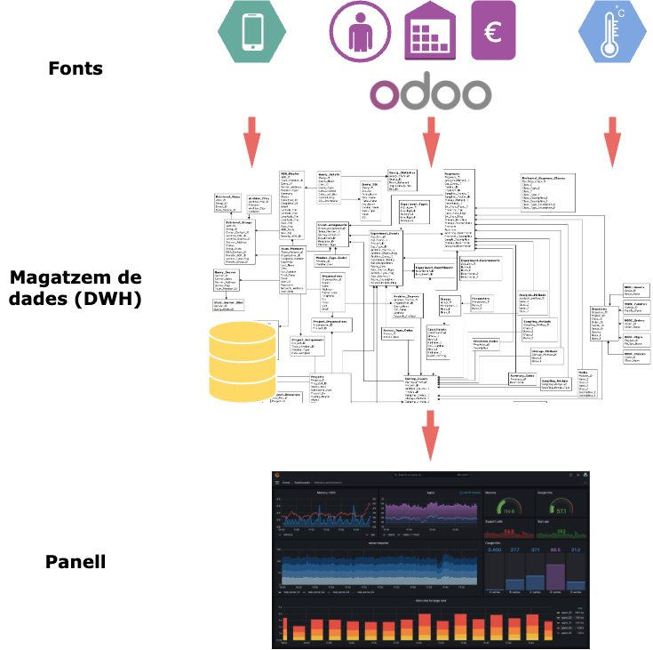

[Tornar a l'inici](../../../index.html)  

> **Enllaços útils**  
> &#8594; [Recursos professorat](./professorat/index.html)  
> &#8594; [Recursos alumnat](./alumnat/index.html)  
> &#8594; [Recursos avaluació](./alumnat/avaluacio)  

## Introducció  
La gestió correcta i eficient de sistemes d'informació digital i de les dades que contenen són tasques fonamentals en qualsevol àmbit professional en l'actualitat. Una aplicació habitual n'és la integració estructurada de dades de diferents fonts d'informació en un únic sistema, amb un ús i fi concrets i coherents amb l'activitat de l'entitat que definix els requisits de l'encàrrec. Aquestes estratègies s'emarquen dins l'**aprofitament de les dades**.  

---

## Context
### Mòdul
Mòdul de "Sistemes de Big Data (5074)" dins el "Curs d'especialització en Intel·ligència Artificial i Big Data" de la Formació Professional Superior.  

És recomanable, si és possible, desenvolupar aquest projecte de manera conjunta amb el mòdul de <i>Big Data aplicat (5075)</i>, ja que els continguts dels currículums d'ambdós mòduls són complementaris.

### Elements curriculars
Els elements curriculars treballats en aquest projecte es descriuen en el següent enllaç, a la pàgina [IABD 5074 - elements curriculars](https://docs.google.com/spreadsheets/d/1H4MfcKbWz9OEfpoCuuIpFZQTbaUbafKt/edit?usp=sharing&ouid=115115241295660704975&rtpof=true&sd=true).

---

## Objectius
L'<b>objectiu</b> d'aquest projecte és que l'alumnat s'introduïsca en el camp de l'aprofitament de dades desenvolupant tasques d'arquitectura de dades, enginyeria de dades i enginyeria d'intel·ligència de negoci (BI), principalment. Amb aquesta meta en ment, es durà a terme el següent projecte anomenat <b>"Implementació d'un magatzem de dades per al seu aprofitament analític"</b>, en el qual es dissenyarà i implementarà un magatzem de dades (DWH) que integrarà fonts diverses de manera estructurada, i es dissenyarà i crearà un informe en línia interactiu (també anomenat quadre de comandament) que s'alimente de les dades del magatzem de dades i incloga indicadors de progrés i èxit de l'objectiu definit inicialment. Amb açò es pretén que l'alumnat...  

...en relació a l'**extracció, integració i processament de dades**:
- Aplique tècniques per extreure, combinar i processar dades de fonts diverses segons la seua tipologia.
- Conega i utilitze tecnologies i mètodes adequats per a la integració i transformació de dades.

...en relació a la **definició d’objectius i gestió del projecte**:
- Definisca objectius coherents amb les dades disponibles i l’ús previst, valorant la seua utilitat.
- Organitze i execute les tasques del projecte dins dels terminis, reflexionant sobre els resultats obtinguts.

...en relació a la **manipulació i anàlisi de dades**:
- Utilitze llibreries i eines per a la manipulació i anàlisi de dades segons els requeriments.
- Aplique tècniques bàsiques de predicció i en funció dels diferents tipus de dades.

...en relació a la **visualització i presentació de dades**:
- Cree visualitzacions i quadres de comandament adequats al context i als objectius del projecte.
- Desenvolupe solucions d’intel·ligència de negoci estructurades per a l’aprofitament de dades.

...i que adquirisca:
- Millora en la capacitat de priorització i gestió del temps.
- Habilitats de resolució de problemes nous seguint estratègies científiques.
- Millora en la capacitat d'anàlisis, valoració i reflexió sobre el treball propi.
- Sentit estètic coherent.

---

## Resum de les tecnologies emprades
- VirtualBox (virtualització)
- PostgreSQL, pgAdmin
- mySQL, phpMyAdmin
- Odoo
- Docker
- SQL
- Python
- Grafana

---

## Resum de recursos de referència

- [The Data Warehouse Toolkit, 3rd Edition](https://www.kimballgroup.com/data-warehouse-business-intelligence-resources/books/data-warehouse-dw-toolkit/)
- [Big Book of Data Warehousing and BI](https://www.databricks.com/sites/default/files/2025-03/OReilly-Understanding-ETL.pdf)
- [Canal de YouTube: Postgres Open](https://www.youtube.com/@postgresopen/videos)
- [PostgreSQL Performance Tuning](https://www.percona.com/resources/elevate-your-postgresql-performance)
- Documentació oficial de cada tecnologia

---

## Coneixements previs
L'alumnat procedix de titulacions de FPS de diferent natura (DAW, DAM, ASIX, teleco, robòtica, mecatrònica). No obstant, s'espera que almenys tinguen uns coneixements bàsics de programació, bases de dades, SQL, APIs, Docker i GitHub, que seran necessaris per poder seguir els continguts del curs amb comoditat.  

---

## Desenvolupament i metodologies  

Per al projecte "Implementació d’un magatzem de dades per al seu aprofitament analític", es dissenyarà i posarà en marxa d’un magatzem de dades capaç d’integrar fonts d’informació diverses de manera estructurada. A més, es crearà un informe interactiu en línia (o quadre de comandament) alimentat per aquest magatzem, que inclourà indicadors clau de seguiment i èxit relacionats amb l’objectiu inicialment definit. La imatge següent representa l'arquitectura general del projecte:

  

La dinàmica general del projecte consistirà a realitzar revisions teòriques de conceptes i tecnologies per, tot seguit, aplicar l'explicació al projecte de desenvolupament pràctic.  

S'utilitzaran les següents metodologies de treball:
- Classe magistral participativa
- Treball en equip
- Aprenentatge basat en simulació de cas real
- Aprenentatge-investigació
- Pràctica guiada

---

## Entregues
Hi haurà un total d'onze entregues durant aquest projecte, de diferent natura (presentacions, resultats de la fase del projecte, comprovacions), i amb un pes proporcional als elements curriculars involucrats i al temps de treball requerit.

Les entregues es descriuen amb detall en el següent enllaç, a la pàgina [IABD 5074 - avaluació](https://docs.google.com/spreadsheets/d/1H4MfcKbWz9OEfpoCuuIpFZQTbaUbafKt/edit?usp=sharing&ouid=115115241295660704975&rtpof=true&sd=true): de la Tasca0 a la Tasca10.  

L'avaluació de cada entrega es realitzarà seguint els mètodes i criteris descrits per a cada una, que es troben a la carpeta [alumnat/avaluació](./alumnat/avaluacio).  

---

## Recursos
Els recursos disponibles únicament per al **professorat** es troben a la carpeta [professorat](./professorat/index.html).  

Els recursos disponibles per a l'**alumnat** es troben a la carpeta [alumnat](./alumnat/index.html), incloent tota la teoria, la pràctica i els continguts relatius a l'avaluació.  

---

## Seqüenciació
25 sessions d'una classe a la setmana (3 hores).  

Els horaris del mòdul es detallen a l'enllaç següent, en la pestanya
[IABD - horaris](https://docs.google.com/spreadsheets/d/1H4MfcKbWz9OEfpoCuuIpFZQTbaUbafKt/edit?gid=1700169753#gid=1700169753).

### Unitat de Treball 0. Introducció al _Big Data_ i a l'aprofitament de dades
2 sessions.  

Introducció 
&#8594; [Teoria - Introducció](./introbigdata.html)   
Pràctica: Introducció al Projecte
&#8594; [Projecte - Introducció](./introprojecte.html)   

Entregues: Tasca0.

### Unitat de Treball 1. Ingesta de dades
4 sessions.  

UT1
&#8594; [Teoria - Unitat de Treball 1. Ingesta de dades](./ut01_ingesta.html)  
Pràctica
&#8594; [Projecte - Unitat de Treball 1](./ut11_projecte.html)  

Entregues: Tasca1, Tasca2, Tasca3. 

### Unitat de Treball 2. Transformació de dades
6 sessions.  

UT2
&#8594; [Teoria - Unitat de Treball 2. Transformació de dades](./ut02_etlqd.html)  
Pràctica
&#8594; [Projecte - Unitat de Treball 2](./ut12_projecte.html)  

Entregues: Tasca4.

### Unitat de Treball 3. Emmagatzematge i Modelatge de dades
5 sessions.  

UT3
&#8594; [Teoria - Unitat de Treball 3. Emmagatzematge i Modelatge de dades](./ut03_model.html)  
Pràctica 
&#8594; [Projecte - Unitat de Treball 3](./ut13_projecte.html)    

Entregues: Tasca5. 

### Unitat de Treball 4. Analítica de dades i indicadors
3 sessions.

UT4
&#8594; [Teoria - Unitat de Treball 4. Analítica de dades i indicadors](./ut04_analit.html)   
Pràctica
&#8594; [Projecte - Unitat de Treball 4](./ut14_projecte.html)   

Entregues: Tasca6.

### Unitat de Treball 5. Visualització de dades
4 sessions.

UT5
&#8594; [Teoria - Unitat de Treball 5. Visualització de dades](./ut05_visual.html)    
Pràctica 
&#8594; [Projecte - Unitat de Treball 5](./ut15_projecte.html)   

Entregues: Tasca7.

### Tancament del projecte
1 sessió.

Presentació i avaluació final del projecte.

Entregues: Tasca8, Tasca9 i Tasca10.

---

## Avaluació
L'avaluació d'aquest projecte es descriu amb detall en el següent enllaç, a la pàgina [IABD 5074 - avaluació](https://docs.google.com/spreadsheets/d/1H4MfcKbWz9OEfpoCuuIpFZQTbaUbafKt/edit?usp=sharing&ouid=115115241295660704975&rtpof=true&sd=true).   

L'avaluació de cada entrega es realitzarà seguint els mètodes i criteris descrits per a cada una, que es troben a la carpeta [alumnat/avaluació](./alumnat/avaluacio).   

---

## Atenció a la diversitat
Tot el material s'ha preparat atenent a la possibilitat de la necessitat de realitzar aquestes dues adaptacions:
- Idioma: el contingut està disponible en un format senzill compatible amb els principals navegadors, que aporten les eines necessàries per a la seua adaptació lingüística.
- Visuals: el contingut està disponible en un format senzill compatible amb els principals navegadors, que aporten les eines necessàries per a la seua adaptació visual.

---

## Línies futures i propostes de prova i millora

Eines:
- Polars: data analysis   
https://pola.rs/   
["An Introduction to Polars: Python's Tool for Large-Scale Data Analysis" by DataCamp](https://www.datacamp.com/blog/an-introduction-to-polars-python-s-tool-for-large-scale-data-analysis)
 
- DLT: data loading   
https://dlthub.com/
 
- DataFusion in Python: ETL, pipelines...  
https://github.com/apache/datafusion-python  
https://datafusion.apache.org/python/

- Pentaho: graphic ETL  
https://pentaho.com/

- PostgreXL, pglogical  
https://github.com/2ndQuadrant/pglogical

Estratègies:
- Canviar l'objectiu a la creació d'un "llac de dades" (_data lake_), per integrar fonts no estructurades i múltiples aplicacions d'integració i analítica de dades
- Crear més d'un model dins el _data lake_, amb diferents objectius
- Usar alguna tecnologia enfocada a la computació distribuïda dins el _data lake_
- Examinar les possibilitats de configuració de computació distribuïda de les eines més tradicionals
- Realitzar el projecte en conjunt amb el mòdul "Big Data aplicat"
- Realitzar el projecte en conjunt amb la resta de mòduls del curs
- Definir un únic cas per a tota la classe, i deixar llibertat a l'hora d'implementar les fases del projecte
- Definir un únic cas per a tota la classe i també el resultat de cada fase del projecte (pràctica completament guiada)